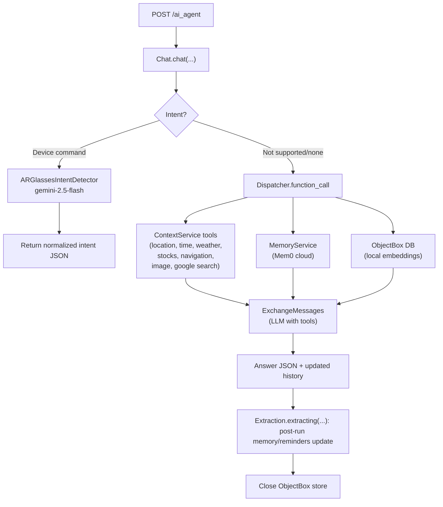

# AI Desktop Agent API (for AR Glasses)

A lightweight FastAPI service that powers an AI agent for AR glasses and desktop use. It routes user queries through:
- **Intent recognition** for device control (open app, take photo, volume up/down, etc.).
- **Conversational QA** with **tool-calling** (weather, time, location, stocks, navigation, image analysis, web search).
- **Long‑term memory** (Mem0) and **local reminders/cache** (ObjectBox + OpenAI embeddings).
- **Post‑response extraction** that updates memory/reminders automatically.

> **Python**: 3.13+ • **Server**: FastAPI + Uvicorn • **LLM**: Google Gemini (google‑genai) • **Vector DB**: ObjectBox • **Memory Sync**: Mem0

---

## Quick Start

```bash
# 1) Create and activate a virtualenv (example with Python's venv)
python -m venv .venv
source .venv/bin/activate  # Windows: .venv\Scripts\activate

# 2) Install dependencies (choose ONE method)

# Option A: via uv (recommended if you use uv.lock)
pip install uv
uv sync

# Option B: via pip using pyproject deps
pip install -U pip
pip install -e .

# 3) Set environment variables (see .env example below)

# 4) Run the API server
python main.py
# -> starts FastAPI on http://0.0.0.0:8000
```

Once running, call the HTTP endpoint:

```bash
curl -X POST http://10.1.12.3:8000/ai_agent \
  -H "Content-Type: application/json" \
  -d '{"user_id":"xx", "query":"how'\''s the weather?", "history":[]}'
```

Equivalent (easier quoting):

```bash
curl -X POST http://10.1.12.3:8000/ai_agent \
  -H "Content-Type: application/json" \
  -d '{"user_id":"xx","query":"how'"'"'s the weather?","history":[]}'
```

---

## What It Does (High Level)



- **Intent path**: If the model recognizes a device-control command (e.g., _“take a photo”_), you get a structured intent payload.
- **Chat path**: Otherwise it calls tools (weather/time/etc.), converses, and returns a natural-language answer. After responding, it **extracts memories/reminders** and persists them.

---

## Project Layout

```
.
├── core/
│   ├── chat/
│   │   ├── chat.py                 # Chat entry; wires everything together
│   │   └── chatbot.py              # Conversation + tool-calling via Gemini
│   ├── llm_runtime.py              # google-genai configs, tool schemas
│   ├── memory/
│   │   ├── extraction.py           # Post-chat memory/reminder extraction
│   │   ├── objectbox_memory.py     # ObjectBox vector store using OpenAI embeddings
│   │   └── objectbox-model.json    # ObjectBox model schema
│   └── constants.py                # Prompts, tool declarations
├── intent_recognition_llm/
│   ├── device_controller.py        # AR glasses intent detector
│   └── constants.py                # Device command catalog + prompt
├── services/
│   ├── dispatcher.py               # Routes logical function calls to services
│   ├── context_service.py          # Gemini + IPGeo + Open-Meteo + Alpha Vantage
│   └── memory_service.py           # Mem0 client + ObjectBox wrapper
├── main.py                         # FastAPI app + /ai_agent endpoint
├── pyproject.toml                  # Runtime deps (Python 3.13+)
└── uv.lock                         # (optional) pinned lockfile for uv
```

---

## Requirements

- **Python** 3.13+
- **OS**: Linux/macOS/Windows (ObjectBox is prebuilt for common platforms)
- Network access to external APIs you enable (see below).

### Python Dependencies (from `pyproject.toml`)
- `fastapi`, `uvicorn`
- `google-genai` (Gemini 2.x)
- `python-dotenv`, `dotenv`
- `loguru`, `pydantic`
- `mem0ai`
- `objectbox` (local vector DB)
- `statistics`

> Install using `uv sync` (preferred) or `pip install -e .`

---

## Configuration

Place a `.env` file at repo root or set system env vars.

```dotenv
# === Required for core chat/intent ===
GEMINI_API_KEY=your_gemini_key

# === Required for ObjectBox embeddings (local reminder cache) ===
OPENAI_API_KEY=your_openai_key

# === Required if you use cloud memory sync ===
MEM0_API_KEY=your_mem0_key

# === Optional: external tools ===
# IPGeolocation (ipgeolocation.io) – used for IP->location and timezone
IPGEO_API_KEY=your_ipgeo_key
# Alpha Vantage – used for get_stock
STOCK_API_KEY=your_alpha_vantage_key
```

**Notes**
- `ContextService` falls back to the above keys when its constructor args are not provided.
- ObjectBox embeddings use `text-embedding-3-small` by default (1536 dims).

---

## Running

### Development (simple)
```bash
python main.py
# Serves on 0.0.0.0:8000
```

> `main.py` constructs the `FastAPI` app inside `if __name__ == "__main__":`.  
> Prefer `python main.py` rather than `uvicorn main:app`, unless you refactor `app` to module scope.

### Production (example)
Run behind a reverse proxy (nginx/traefik) and a process manager (systemd, supervisord, Docker). If you refactor `app` to module scope you can do:

```bash
uvicorn main:app --host 0.0.0.0 --port 8000 --workers 2
```

---

## API

### `POST /ai_agent`

**Body**
```json
{
  "user_id": "string",
  "query": "string",
  "history": []   // array; pass [] for new sessions
}
```

**Responses (shape examples)**

- **Device intent detected** (from `ARGlassesIntentDetector`):
```json
{
  "status": "success",
  "content": [
    {
      "command_code": "takePhoto",
      "args": { "camera": "rear" }
    }
  ]
}
```

- **Conversational answer** (tools may be called under the hood):
```json
{
  "response": "In Shenzhen, it's mostly cloudy, around twenty nine degrees, with a chance of light rain this afternoon.",
  "history": [
    [{"role":"user","content":"how's the weather?"},{"role":"assistant","content":"..."}]
  ]
}
```

**Example curl** (exactly as used in dev logs):
```bash
curl -X POST http://10.1.12.3:8000/ai_agent \
  -H "Content-Type: application/json" \
  -d '{"user_id":"xx", "query":"how'\''s the weather?", "history":[]}'
```

---

## Tooling & Integrations

- **Google Gemini (google‑genai)**  
  - Model: typically `gemini-2.5-flash` (intent, quick tool calls) and JSON‑mode configs (see `core/llm_runtime.py`).
  - Tool schemas declared in `core/constants.py` and wired via `Dispatcher`.

- **ContextService**  
  - `get_user_location` → ipgeolocation.io  
  - `get_time` → ipgeolocation.io (timezone endpoint)  
  - `get_weather` → open‑meteo.com (current + daily)  
  - `get_stock` → Alpha Vantage (Global Quote)  
  - `navigation_data`, `analyze_image`, `google_search` → Gemini tools / content APIs

- **MemoryService**  
  - **Mem0**: `memory_add`, `memory_update`, `memory_delete`, `memory_retrieve`  
  - **ObjectBox**: local “reminders/cache” with OpenAI embeddings (`text-embedding-3-small`) for semantic retrieval.

- **Post‑response extraction** (`core/memory/extraction.py`)  
  After each chat round, the agent analyzes `query_history`, predicts memory/reminder actions via **function calling**, and persists them through `Dispatcher`.

---

## Extending the Agent

1. **Add a new tool**
   - Declare schema in `core/constants.py` (for chat) or extraction schema (for memory actions).
   - Expose an implementation in `services/context_service.py` or `memory_service.py`.
   - Register the function name in `services/dispatcher.py`’s `DISPATCH` map.

2. **Tune prompts**
   - Conversation: `core/constants.py` → `QUERY_ACTION_PROMPT`, `OUTPUT_PROMPT`.
   - Intent detection: `intent_recognition_llm/constants.py` → device command catalog + prompt.

3. **Close resources**
   - `Dispatcher.close()` ensures ObjectBox store is closed after each request (see `core/chat/chat.py`).

---

## Security & Ops Notes

- Store API keys in environment variables, not in code or version control.
- Put the service behind a private network or reverse proxy with authentication if exposed beyond localhost.
- Rate‑limit or gate endpoints if necessary.
- Log PII carefully; redact sensitive contents in production logs.

---
## License

TBD.